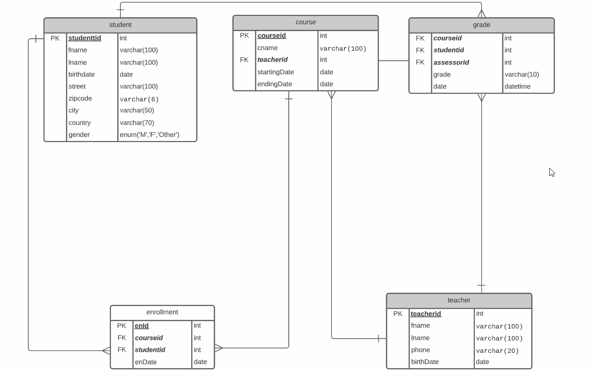

# Introduction to Database & Database Design - CH2
### What is a database? 

- An ***organized  collection*** of related data (structured information) 
    -  Stored in **logical and structured** manner
    - Typically stored electronically in a computer system
- Databases are everywhere 
    - points related to course assignments are recorded in the database
    - if you do enough work on the course to achieve the learning objectives related to the course, your grade will be recorded in the database
    - Application utilizes one or more databases
- Databases can be **local** (located on the same machine)
- Databases can be **external** (located on a separate server)
- Information is retrieved from the database and presented to the end-user via an application  

### What is Database Management System (DBMS) ?
- A database management system is an application through which a user can create and maintain databases.
    > Example: **MySQL**, Microsoft Access, Microsoft SQL Server, FileMaker Pro, Oracle Database, and dBASE

- DBMS provides multiple functions for managing databases & its data. These functions can be classified as below: 
    - **Data definition**: Organization of the data (creating, modifying & removing)
     - **Update** – Insertion, modification, and deletion of the actual data.
     - **Retrieval** – Getting data for presentation or further processing by an application.
     - **Administration** – Managing database users, databases, enforcing data security, monitoring performance, maintaining data integrity, database backups
- **MySQL is a popular, open-source DBMS**

### Benefits of a Database System
- Centralized data management.
- Data duplication is reduced or managed.
- Data inconsistency can be avoided.
- Multiple users can access data, even at the same time.
- Standardization is easier.
- Data access rights can be secured.
- Data is more reliable and accurate.
- Different operating needs can be considered when building the system.
- Easier deployment of new applications.
- Provides mechanisms for data backup and recovery.

### What is a Relational Database ?
- A relational database is based on the ***relational data model.***
- A relational database stores data in the form of rows and columns that forms an ***entity(table).***
- It allows to store data across multiple table. Tables are related to each other ***(relationship)***

- To interact with databases, it uses ***Structured Query Language (SQL)*** 
 - SQL is used to store, modify and maintain the data.
- It is the most common type of `DBMS`

**Example of an entity/table**

## Database Design: 
### What is Data Modeling? 
> It is a process to define and analyze data requirements to support a certain busines sprocess or to serve a purpose. 

###  Database Design Process

**Step 1: Requirement Analysis - Define the purpose of the Database**
- ***You can think of questions such as***
    - Why do you need a database?
    - What data you will be storing? 
    - What kind of entities you might need?

**End result: Conceptual Model**

**Step 2: Define the attributes of the entities that you discovered from Step 1** 
- ***You may do the following activities***
    - List column names (attributes)
    - Specify data types such as number, text etc. 
    - Specify **Primary Key** for each **entity**. 

**End result: Logical Data Model**

**Step 3: Define relationships among tables**

- ***You may do the following activities***
    - Specify data types such as VARCHAR, INT, BOOLEAN.
    - Specify Foreign Keys
    - Define what kind of relationship exist between tables. 

**End result: ER Diagram / Database Model**

**Step 4: Normalize your design**
- **You may do the following activities**
    - Analyze your tables to ensure  they meet the criteria of 3NF.
    - Break down larger tables into smaller ones to reduce redundancy.
    - Evaluate your data structure for potential data dependencies that can be resolved by adding columns or creating separate tables.

**End result: ER Diagram / Database Model**

---
### Tools for Data modeling
You may use any of the following options:
- A piece of paper and a pen to model your database. 
- **Lucidchart:** https://www.lucidchart.com/ The free option is enough for us to design our databases. (***I am using Lucidchart***)
- Draw.io https://app.diagrams.net/

### Types of Data Models
***Before creating an actual database, you produce three different types of data models:***

#### 1. ***Conceptual Data Model***
- It is a highl level model.
- Think about the data requirements: what data your system contains? Take into account your stakeholders: application users & scope of your application 
- You are basically explaining the concept based on your data requirements & the relationship between the objects
-  The end result of the conceputal data model will be names such as `student`, `course`, `teacher`
- The relationship between the objects are simply shown by drawing a line between the objects.
- This model is done for wider audience that is it should be easy to understand for anyone looking the diagram. 

    **Hint: Represent data as a normal user will see it in the real world.** 

##### Example of a Conceptual Data Model: A teacher will teach a course(s) and student can participate in a course(s).

#### 2. ***Logical Data Model***
- The logical data model defines the structure of the data.
- Each object is defined in details that is you inform about each of your object. In the above case, you need to define information for `student`, `course` & `teacher`
- You need to explain data types such as number or string for each of your data attribute.
- It also shows the relationships between objects. 
   
##### Example of a Logic Data Model: Each object is defined in details. 

#### 3. ***Physical Data Model***
- It is describing a database specific implementation of the data model. 
- It is used to creata a database and required tables.
- It includes the name of the table & column names with [Data Types](https://dev.mysql.com/doc/refman/8.0/en/data-types.html). 
- ***Primary keys, foreign keys, views*** etc are also defined. 
    
##### Example of a Physical Data Model: Each object is defined in details. 

> Note: We did not specificy primary or foreign key. Once we learn them, we will start to use them.

### PRIMARY KEY (PK)

- The relational data model can not contain duplicate values. The duplicate values create ambiguities in retrieval, therefore  **primary key (PK)** is used to uniquely identify each record in a database table. 

- **Common Rules for Primary Key**
    - Must contain unique values and Not NULL
    - Most tables have a primary key
    - A table has only one primary key
    - Primary key column’s type is often an integer type (INT or BIGINT)
    - Primary key column often has AUTO_INCREMENT attribute that generates a unique sequence for the key automatically. 

- Sometimes you have an obvious choice for selecting a primary key such as the registration number of a car, other times it can be difficult. 
- One of the common solution for primary key is to allocate a number and use autoincrement (studentID, playerID, staffID)
- It is possible to have a primary key that is made up of more that one attribute which is called a **composite primary key**

***Now lets update our Data Model by including primary key***

***Example of a Physical Data Model: Each object is defined in details.***

### COMPOSITE KEY

- It is made up of more than one attribute

- In the above table, none of the attributes can be guaranteed to be unique 
    - A student however is enrolled for a course therefore the combination of Course and StudentId will be unique. 
    - Combining these two attributes will form a **composite primary key**
- To avoid the **composite key**, you may create a new attribute enrollmentID as an integer & make it autoincrement. However, this will create an extra (unnecessary column), therefore a more effective choice is a **composite key.**

### FOREIGN KEY (FK)

- It is the primary key field of one table, that is stored in another table for the purpose of creating a link (join) between the tables.
- Typically, a **foreign key** in one table points to the primary key in another table.

- In the above table,the **StudentId** attribute is used to avoid duplicates because there can be two students with same first and last name.
- To access name or student’s detail info, you have to access **StudentInfo** table
- StudentId is the **primary key** of the **StudentInfo** table. This is referred to as **parent table.**
- In the grade table, **StudentId** is a **foreign key**. This is referred to as **child table.**
- In order to combine information from two tables, there muse be primary/foreign key pair.

***Read More on Foreign Key: https://dev.mysql.com/doc/refman/8.0/en/create-table-foreign-keys.html***

### ENTITY RELATIONSHIP DIAGRAM
- It is a top-down technique for visualizing and understanding the entities and the relationships between them. 
- An **entity–relationship diagram (or ER diagram)** describes 
    - the entities
    - logical structure of the entities (attributes) and 
    - relationships between the entities
- Each **entity** in an ER diagram is represented by a rectangle. 
- **Relationship** is an association between two or more entities.
 `Example: the relation between the course and student table is that a student can enroll to one or many coourses.` ***It is shown by a line and can be one of the three types***
    - **One-to-one relationship** (It is not very common type of relationship)
    - **One-to-many relationship** (The most common type of relationship )
    - **Many-to-many relationship** (It is not ideal in the database design)
## Types of relationships
### One-to-one relationship

- As the name suggests, **One-to-one** refers to the association between two entities(tables) A & B in which one element from A is linked to one element of B. 
- In the **relational model**, it means that one row in a table is linked with only one row in another table and vice versa.

> Examples:

    - Your address has only 1 postal code. 
    - Each course has only 1 capital city.

### One-to-many relationship
- **One-to-many** refers to the association between two entities(tables) A & B in which one element from A is linked to multiple elements of B.
- In the **relational model**, it means that one row in a table is linked with many rows in another table and vice versa.
- It is the most commmon type of relationship. 

> Examples:

    - A city has multiple Zip codes
    - A teacher can teach many courses. 

### Many-to-many relationship

- **Many-to-many** refers to the association between  entities(tables)  in which many elements from one entity are linked to many elements in another entity.
- In the **relational model**, it means that multiple rows in a table are linked with multiple rows in another table and vice versa.
    

### How to handle Many-to-many relationship in database design?
- Lets think about the **student** and **course** tables, ***a student can enroll in many courses and a course has many students***. 
     - The relationship in this case is many to many relationship ***which is not an ideal situation in database design as it becomes difficult to manage many to many relationship using those two tables***. 
     - To store data effectively, we can think of a adjoining table that relates both of those two tables by establishing one to many relationship. 
     - ***In practice, the many-to-many relationship is implemented as two one-to-many relationships, with the introduction of the adjoining (junction) table.***
        - One student can have one to many enrollments. 
        - A course can have one to many enrollments.

---
## Normalization 
- Normalization is the process of organizing data (attributes of the database) to 
reduce the **redundancy of data** in the table and to improve the **integrity of data**. It also helps to reduce data duplication. The goal is check if the database is optimal and structurally correct. 
- ***What is data redundancy in database?***
    - Having same data in multiple locations.
    - It increases the size of the database as same data is repeated. 
    - The duplicate data results inconsistency problems during inserting, updating and deleting operations. 
> Note: if the table is not normalized, there will be problems when updating, inserting and deleting data. 

***You can start to check your tables based on the following normalizatoin rules (Normal Forms)***
### First Normal Form (1NF)
- It is the first stage of the normalization process. 
- A table is in **1NF**  if 
    - each record is unique
    - Data in each column is **atomic**. ***Data is atomic when a column contains a single value not a lits of values and the value can not be broken down further.***
    - No repeating groups of attributes for records: 
        - A repeating group of attributes is a set of attributes that appear more than once within the record structure.
        - Sometimes a single attribute will repeat, and this must be dealt with
        - When you find a repeating group of attributes, it must be moved to a new table.

***Example 1: student_info***
The table student_info does not meet the requirements of 1NF because 
- The `Name` column can be sub divided into two different fields first name and last name
- The `Courses` column contains multiple values. 

***Lets do the required changes so that student_info table is in 1NF***
- Break full name into two columns fname & lname. 
- Remove course column, we will need a separte table for course enrollment.
- **The table below meets the 1NF requirements**

### Second Normal Form (2NF)
- It is the second stage of the normalization process.
- The first requirements is that it meets all conditions for **1NF**
- Every non-key column is fully dependent on the primary key. There should not be any partial dependencies.
- If the primary key is made up of with the combination of columns (composite key), every non-key column shall depend on the composite key. 

### Third Normal Form (3NF)
- It is the third stage of the normalization process.
- The first requirements is that it meets all conditions for **2NF**
- The non key columns are independent of each others that is the non key columns are dependent only on the primary key. ***There must not be any transitive dependency that is non-key dependencies.*** You don’t have any data that depends on fields that are not designated a primary key or part of a primary key
- In the table below, **StudentID** depends on **CourseID** and **CourseID** depends on **Course** which is a non key field and has a transitive dependency. ***This does not meet the 3NF requirements.***

- To satisfy **3NF**, break down into 2 tables

## Anomalies
- An anomaly is something that deviates from what is standard, normal or expected
- Anomalies arise when data operations such as inserting, deleting or updating records result in unexpected errors
    - **Insertion Anomalies**
        - If a particular course is only part of an enrollment record, a course can not exist within it having an enrollment
    - **Deletion Anomalies**
        - Data is lost unintentionally (by deleting other data)
    - **Update Anomalies**
        - Data is held in multiple locations, when you make an update, it is made to only 1 version and thus an update anomaly has happened.

> ***On normalizing your data to third form (3NF), anomalies are eliminated***

## Intergrity Rules
- Integrity rules are very important for a good database design. 
- RDBMS enforce integrity rules automatically.

### Entity integrity
- All primary key entries are unique and not null. 
- All entities must have some sort of unique idetification.
- For a composite key which is made up of several columns, none of the column can contain Null.
- All foreign key values are properly referencing primary key valuues.

### Referential Integrity
- The referential integrity is specified between tables (relationship) to ensure the consistencey among tuples(records) of the tables. 
- Each foreign key in a table(child table) must match to a primary key in the referenced table (parent table)
- Inserting with a foreign key is only possible if the value exists in the partent table.

## Example 1: Simple Grading System 

**A simple database design for course enrollment and grading system.**

> Now let's put all pieces what we have learnt so far and create a database design for enrolling and grading a course. 
- Grading includes courses, enrollments, teachers and students
- Think of the entities such as : `student`,`course`,`enrollment`,`grade`,`teacher`,

   

## References: 
- https://en.wikipedia.org/wiki/Database 
- https://en.wikipedia.org/wiki/Data_modeling 
- MySQL Reference Manual: https://dev.mysql.com/doc/refman/8.0/en/ 
