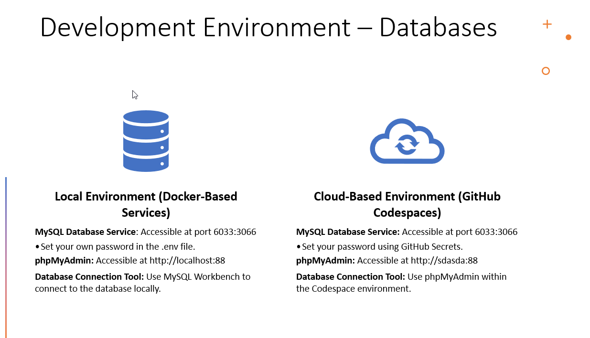
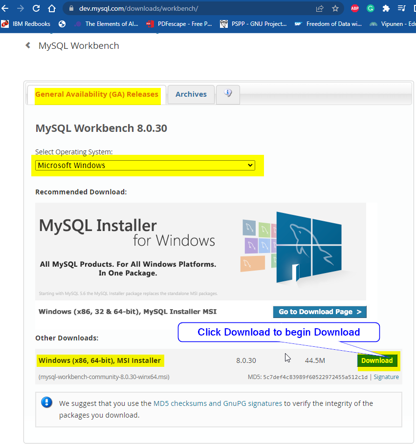
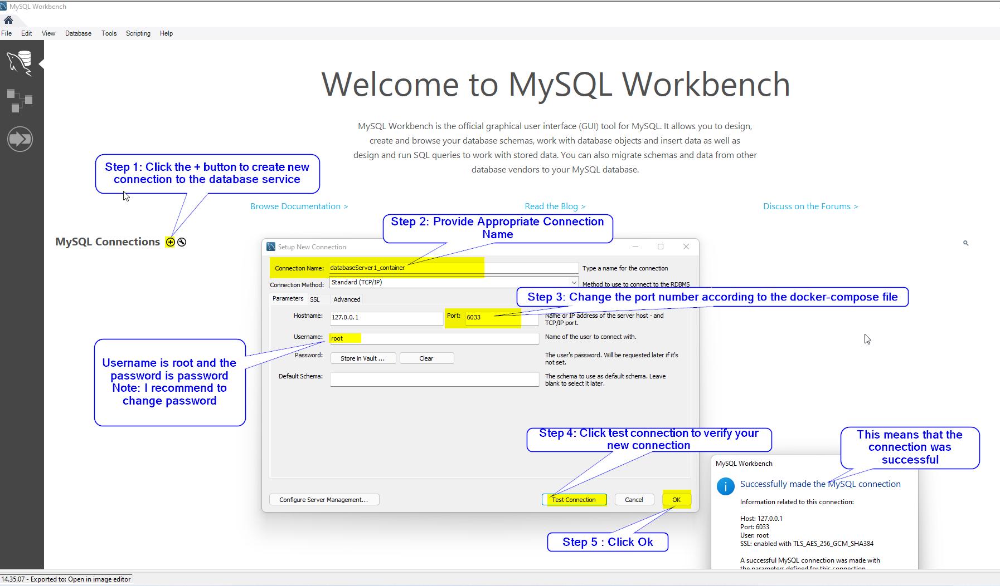
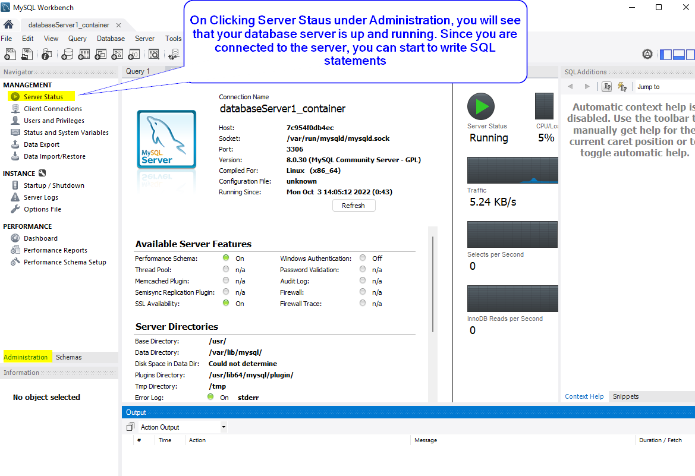
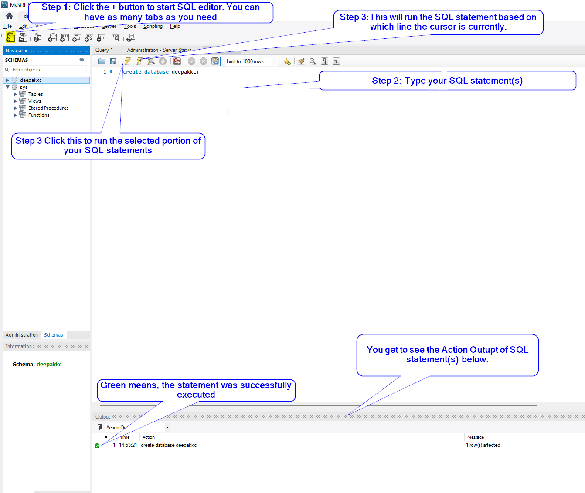

# Getting Started with Databases - CH1

## What is MySQL?
- The most popular Open Source database management system
- Developed, distributed & supported by Oracle Corporation
- MySQL Web site: http://www.mysql.com/
- MySQL databases are relational
- MySQL database server is fast, reliable, scalable & easy to use
- MySQL server works in client/server or embedded systems

**Main features of MySQL**
- Internals & portability  (Written in C & C++, Works on many different platforms) 
- Support for varieties of data types (Data types (signed/unsigned integers 1, 2, 3, 4, and 8 bytes long, FLOAT, DOUBLE, CHAR, VARCHAR, BINARY, VARBINARY, TEXT, BLOB, DATE, TIME, DATETIME, TIMESTAMP, YEAR, SET, ENUM, and OpenGIS spatial types)
- Statements & Functions (Full operator and function support in the  SELECT list and WHERE clause of queries)
- Security (A privilege and password system that is very flexible and secure, and that enables host-based verification.)
- Scalability & limits (Support for large databases) 
- Connectivity (Clients can connect to MySQL Server using several protocols : TCP/IP sockets on any platform)
- Localization (support for several characters set (scandavian characters: Ä Ö Å ), Error messages to clients in many languages)
- Clients & Tools (Command line programs such as mysqldump & mysqladmin, GUI programs such as MySQL Workbench)

## Development Environment Setup 

We need to set up MySQL database servers to create databases. This will also allow us to work with tables and execute SQL queries. In this course, we will use both Docker-based environments locally and GitHub Codespaces for cloud development. For the local environment, we will connect to the database server using MySQL Workbench. In GitHub Codespaces, we will use phpMyAdmin to connect.



### Local Environment (Docker-Based Services)

- **MySQL Database Service**: Accessible at port `6033:3066`
  - Set your own password in the `.env` file.
- **phpMyAdmin**: Accessible at `http://localhost:88`
- **Database Connection Tool**: Use *MySQL Workbench* to connect to the database locally.

### Cloud-Based Environment (GitHub Codespaces)

- **MySQL Database Service**: Accessible at port `6033:3066`
  - Set your password using *GitHub Secrets*.
- **phpMyAdmin**: Accessible at `http://localhost:88`
- **Database Connection Tool**: Use *phpMyAdmin* within the Codespace environment.


### Steps to set up the development environment

> Note: Please ensure that you have Docker Desktop installed in your device and the docker engine is running. 

### Step 1: Fork the Repository

1. Sign in to your GitHub account using a browser.
2. Fork the project to your GitHub account by visiting: [https://github.com/dipaish/mysql-phpmyadmin-docker](https://github.com/dipaish/mysql-phpmyadmin-docker).

### Step 2:  The README file in the forked repository provides detailed guidelines and instructions to set up the development environment. Follow the guidelines. 

**Some docker commands:**
- To start a docker container in the background `docker-compose up –d`
- To list all active containers 
`Docker ps`
- To remove all docker containers in the repository `Docker-compose down`


## Installing MySQL Workbench 
Step 1: Get to this link (https://dev.mysql.com/downloads/workbench/) and download MySQL Workbench **Windows (x86, 64-bit), MSI Installer** & install MySQL Workbench. 



## How to connect to the Database server in Docker container using MySQL Workbench?

***Now that we have the necessary tools, we will use MySQL Workbench to connect to the database service running in a docker container.***

- Step1: Make sure that your Docker Engine is running & the docker service is up and running. You may run the service by typing the following command in powershell. 

```ps
PS D:\dataService> docker-compose up -d
```
- Step 2: Start MySQL Workbench & add new MySQL Connection


- Step 3: Double Click on the newly created connection and type in your password.  


## Writing your first SQL statement
- ***Create a simple database named fname_lname***


# Working with Databases
### CREATE DATABASE
- **CREATE DATABASE** statement is used to create a database.
- To create a database, you need to have the CREATE privilege for the database
- If the database already exists, you will get an error message when not specifying  **IF NOT EXISTS** clause
- Use meaningful and descriptive name for databases.The best practice is to use lowercase letters for your database names.

**Syntax**
```ps
CREATE DATABASE Database_Name;
```
***Example 1: To create a database named mydb1***
```ps
CREATE DATABASE mydb1;
```
### USE DATABASE_NAME 
- It is necessary to tell MySQL which database to work with. 
- Creating a database does not make it a current database. 
- After selecting the database, operations such as querying data, creating new tables will take effects on the current database.

**Syntax**
```ps
USE Database_Name;
```
***Example 1: To set the working database to mydb1***
```ps
USE mydb1;
```
### SHOW DATABASES
- To display all databases on the database server 

```ps
SHOW DATABASES;
```

### DROP DATABASE_NAME
- DROP statement is used to delete a database. 
- Deleting a database deletes all data and related objects permanently.

**Syntax**

```ps
DROP DATABASE [IF EXISTS] database_name;
```
***Example 1: To delete the database mydb1***

```ps
DROP DATABASE mydb1;
```

### SELECT DATABASE_NAME
- To see which database is currently selected.

```ps
SELECT DATABASE();
```
### SHOW TABLES
- Displays the list of tables in the selected database

```ps
SHOW TABLES();
```
### SQL Comments
- You can use comments to explain your SQL staements. 
```ps
-- this is a single line comment
# this is also a single line comment 
/* 
this is a multiple
line 
comment.
*/
```